# TP3 – Simultaneous Localization and Mapping using Extended Kalman Filter

**Author:** Nívia Araujo da Nóbrega  
**Course:** RO12 – Navigation pous les systèmes autonomes 
**Date:** 2025-10-24  

---

## Influence of the environment

### 1 - Impact of Landmark Configuration and Robot Trajectory on Map Quality and Error Evolution

Original landmark location:

```python
Landmarks = np.array([
        [0.0, 5.0],
        [11.0, 1.0],
        [3.0, 15.0],
        [-5.0, 20.0],
    ])
```

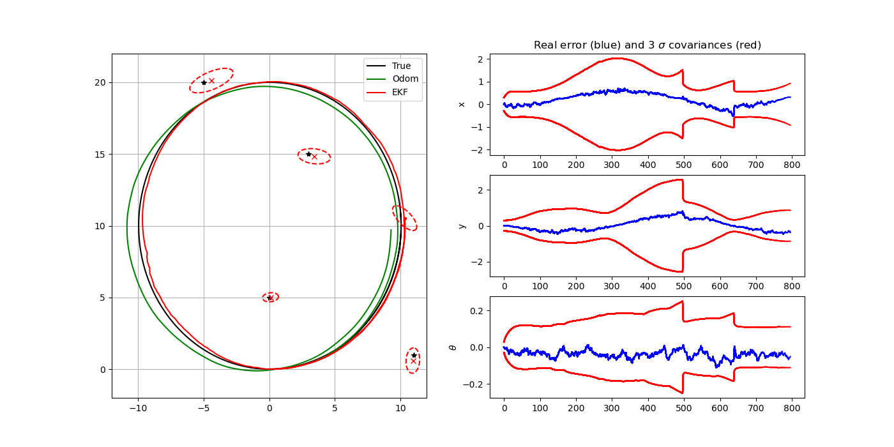
*Sparse and few landmarks on the map*

### Case 1: Short Loop with Dense Local Landmarks

```python
Landmarks = np.array([
    [ 0.0, 10.0],
    [ 0.5, 10.0], [-0.5, 10.0], [ 0.0, 10.5], [ 0.0,  9.5],
    [ 0.7, 10.7], [-0.7, 10.7], [ 0.7,  9.3], [-0.7,  9.3],
    [ 1.0, 10.0], [-1.0, 10.0], [ 0.0, 11.0], [ 0.0,  9.0],
    [ 0.9, 10.4], [-0.9, 10.4], [ 0.9,  9.6], [-0.9,  9.6],
    [ 0.4, 10.9], [-0.4, 10.9], [ 0.4,  9.1], [-0.4,  9.1]
])
```

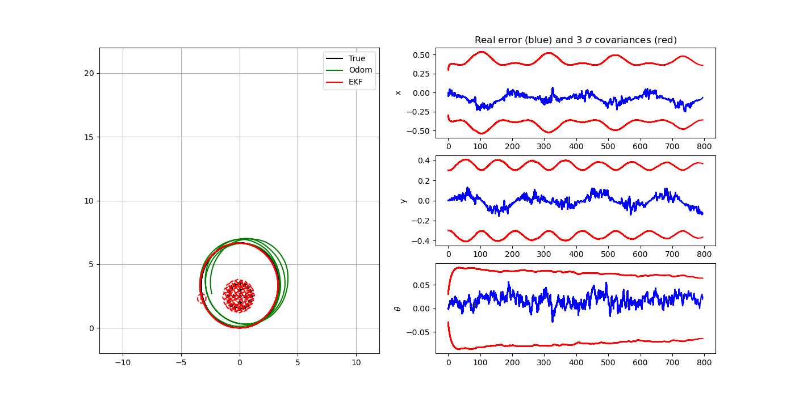
*First case: a short loop and a dense map with many landmarks inside the robot perception radius*

#### Observations:
- **Map Quality**: Excellent - high precision landmark estimates with small covariance ellipses
- **Error Evolution**: 
  - Rapid error reduction early in the trajectory
  - Stable error bounds throughout the mission
  - Minimal error spikes due to continuous landmark observations
- **Loop Closure**: Smooth and barely noticeable in error plots due to constant corrections
- **Covariance Behavior**: Consistently small 3σ bounds indicating high confidence

### Case 2: Long Loop with Distributed Dense Landmarks
```python
Landmarks = np.array([
        [ 0.0,  3.0], [ 3.0,  3.0], [ 6.0,  3.0], 
        [ 6.0,  6.0], [ 6.0,  9.0], [ 6.0, 12.0],
        [ 3.0, 12.0], [ 0.0, 12.0], [-3.0, 12.0],
        [-3.0,  9.0], [-3.0,  6.0], [-3.0,  3.0],
        [ 1.5,  4.5], [ 4.5,  4.5], [ 1.5,  7.5], [ 4.5,  7.5],
        [ 1.5, 10.5], [ 4.5, 10.5], [-1.5,  4.5], [-1.5,  7.5],
        [-1.5, 10.5], [ 0.0,  6.0], [ 3.0,  6.0], [ 0.0,  9.0],
        [ 3.0,  9.0]
    ])
```

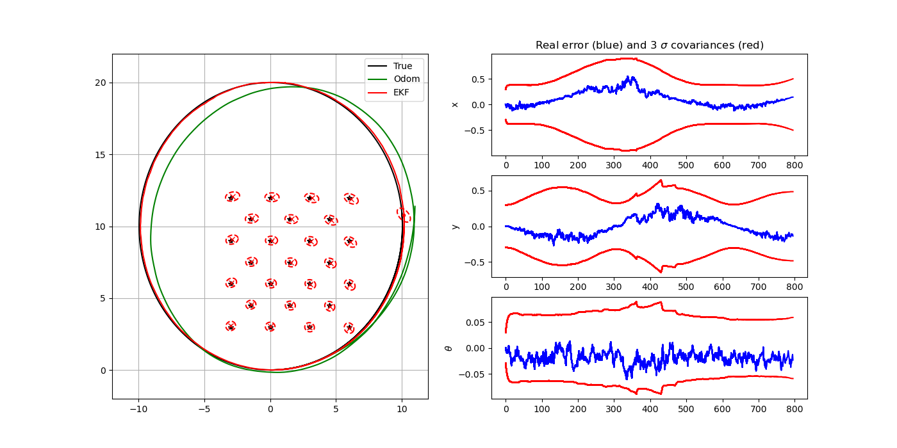
*Second case: a long loop and a dense map with many landmarks all along the loop*

#### Observations

- **Map quality:** High and consistent — landmarks remain accurately estimated across the entire environment, with small and nearly isotropic covariance ellipses. The map shows no noticeable drift or deformation during the trajectory.

- **Error evolution:**
  - Gradual growth of estimation error during the exploration phase, accompanied by a widening of the ±3σ uncertainty bounds.
  - After the loop closes, the error sharply decreases and stabilizes close to zero, with only small residual fluctuations.

- **Loop closure:** A clear but not overly dramatic correction — since the map is dense and informative throughout the trajectory, the EKF does not accumulate large drift. When the robot revisits previously seen areas, the state estimate realigns and the trajectory snaps back to the true path.

- **Covariance behavior:** Uncertainty gradually increases during free motion and then drops significantly after loop closure, converging to a low and stable level. 


```python
Landmarks = np.array([
    [ 2.0,  0.0], [ 1.5,  1.5], [-1.5,  1.5],
    [-2.0,  0.0], [-1.5, -1.5], [1.5,  -1.5],
])
```

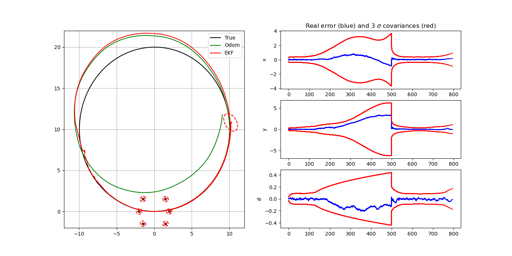
*Third case: a long loop and a sparse map with only few landmarks near the start position*

#### Observations:
- **Map Quality**: Poor - large covariance ellipses and inaccurate landmark estimates
- **Error Evolution**:
  - Rapid error accumulation during most of the trajectory
  - Limited correction capability due to few observations
  - Clear "correction spike" visible in error plots when trajectory gets near the landmarks
- **Loop Closure**: Ineffective - insufficient constraints to correct accumulated drift
- **Covariance Behavior**: Continuously growing uncertainty with poor observability

---

### 2 - Impact of Landmark Configuration and Robot Trajectory on Map Quality and Error Evolution using the Mahalanobis distance


### Case 1: Short Loop with Dense Local Landmarks

```python
Landmarks = np.array([
    [ 0.0, 10.0],
    [ 0.5, 10.0], [-0.5, 10.0], [ 0.0, 10.5], [ 0.0,  9.5],
    [ 0.7, 10.7], [-0.7, 10.7], [ 0.7,  9.3], [-0.7,  9.3],
    [ 1.0, 10.0], [-1.0, 10.0], [ 0.0, 11.0], [ 0.0,  9.0],
    [ 0.9, 10.4], [-0.9, 10.4], [ 0.9,  9.6], [-0.9,  9.6],
    [ 0.4, 10.9], [-0.4, 10.9], [ 0.4,  9.1], [-0.4,  9.1]
])
```

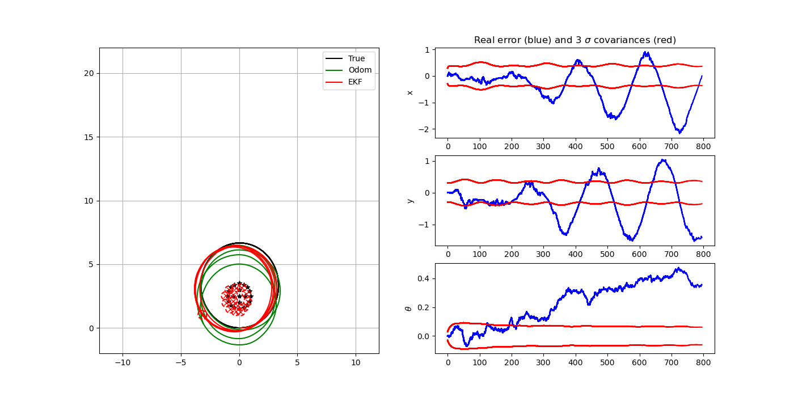
*First case: a short loop and a dense map with many landmarks inside the robot perception radius*

#### Observations

- **Map quality:** Mixed. The central landmark cluster is repeatedly observed and remains roughly consistent, but the robot pose drifts relative to the map. Small red covariance ellipses around the landmarks contrast with the growing pose error.

- **Error evolution:**
  - **x / y:** Errors show a wave-like pattern with increasing amplitude over the run and do not shrink at loop closure; they keep a sizable bias (≈ up to ~2 m).
  - θ (heading): The angle error grows monotonically (to ~0.4–0.45 rad) with only brief pauses. This orientation drift explains the large oscillations in x/y: as heading bias accumulates, position error rotates and grows.

- **Loop closure:** The loop-closure event provides little visible correction. With landmarks concentrated at the loop center, *eading observability is weak, so the accumulated yaw bias is not removed, and the translation error remains large.

- **Covariance behavior:** The ±3σ bounds are too tight and often fail to contain the real error (especially in θ), revealing filter overconfidence. 


### Case 2: Long Loop with Distributed Dense Landmarks
```python
Landmarks = np.array([
        [ 0.0,  3.0], [ 3.0,  3.0], [ 6.0,  3.0], 
        [ 6.0,  6.0], [ 6.0,  9.0], [ 6.0, 12.0],
        [ 3.0, 12.0], [ 0.0, 12.0], [-3.0, 12.0],
        [-3.0,  9.0], [-3.0,  6.0], [-3.0,  3.0],
        [ 1.5,  4.5], [ 4.5,  4.5], [ 1.5,  7.5], [ 4.5,  7.5],
        [ 1.5, 10.5], [ 4.5, 10.5], [-1.5,  4.5], [-1.5,  7.5],
        [-1.5, 10.5], [ 0.0,  6.0], [ 3.0,  6.0], [ 0.0,  9.0],
        [ 3.0,  9.0]
    ])
```

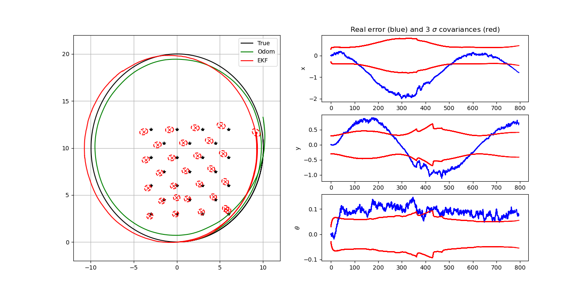
*Second case: a long loop and a dense map with many landmarks all along the loop*

#### Observations

- **Map quality:** Consistent — the landmarks are accurately estimated and well-distributed around the environment. Covariance ellipses remain small and mostly circular, indicating stable and reliable position estimates. 

- **Error evolution:**
  - The position errors oscillate smoothly in a wave-like pattern, reflecting the alternating visibility of landmarks as the robot moves along the loop.
  - The heading error grows to a persistent positive bias (on the order of a few hundredths of a radian, ~0.05–0.12 rad) and exhibits only a brief dip near loop closure.
  - After loop closure, θ does not return to ~0; it stays biased and continues to fluctuate. This orientation bias propagates into position, explaining why x/y errors remain large even after revisiting known landmarks.

- **Loop closure:** The closure event provides limited correction. Because the main error is angular, and the landmark layout offers weak constraints on heading, the pose does not “snap” back strongly; translation remains biased.

- - **Covariance behavior:** The position covariances change smoothly but do not contract enough at loop closure to match the residual errors. The θ covariance stays relatively tight compared to the actual θ error.
 


```python
Landmarks = np.array([
    [ 2.0,  0.0], [ 1.5,  1.5], [-1.5,  1.5],
    [-2.0,  0.0], [-1.5, -1.5], [1.5,  -1.5],
])
```

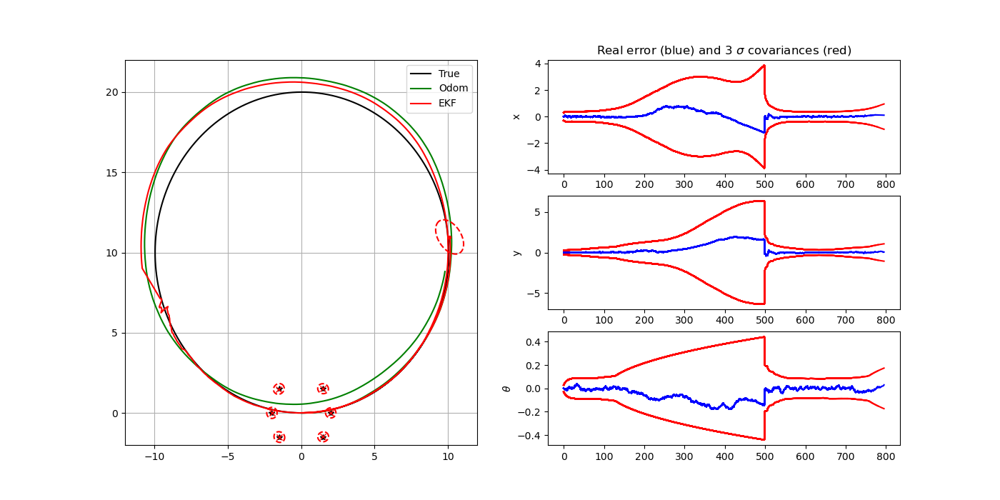
*Third case: a long loop and a sparse map with only few landmarks near the start position*

#### Observations:
- **Map Quality**: Poor - large covariance ellipses and inaccurate landmark estimates
- **Error Evolution**:
  - Rapid error accumulation during most of the trajectory
  - Limited correction capability due to few observations
  - Clear "correction spike" visible in error plots when trajectory gets near the landmarks
- **Loop Closure**: Ineffective - insufficient constraints to correct accumulated drift
- **Covariance Behavior**: Continuously growing uncertainty with poor observability

---


## 3. Effect of Probabilistic Model Tuning (Q and Py) on Filter Performance, Consistency, and Map Quality

**Setup**
- Data association: unknown (`KNOWN_DATA_ASSOCIATION = 0`, Mahalanobis).
- Environment: large loop + sparse map.
- Goal: Compare EKF-SLAM when the estimated noises `Q` (process) and `Py` (measurement) are
  (1) smaller, (2) equal, (3) larger than the simulation noises `Q_sim`, `Py_sim`.

> - Case (1) **Smaller:** `kQ = 0.5`, `kPy = 0.5`
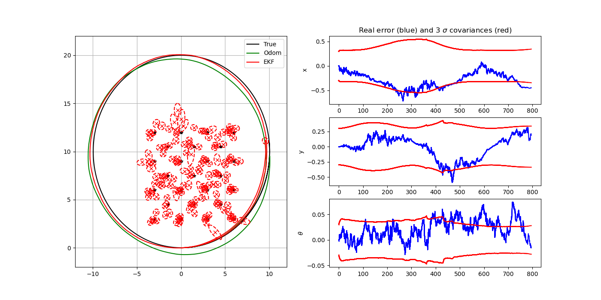
> - Case (2) **Equal:**   `kQ = 1.0`, `kPy = 1.0`
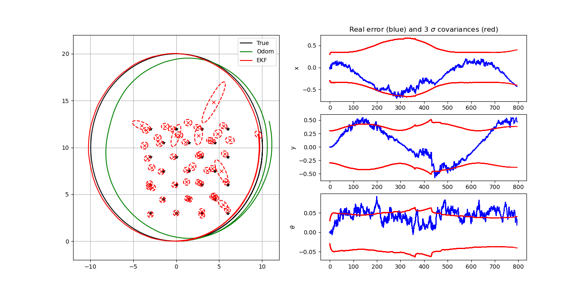
> - Case (3) **Larger:**  `kQ = 3.0`, `kPy = 3.0`
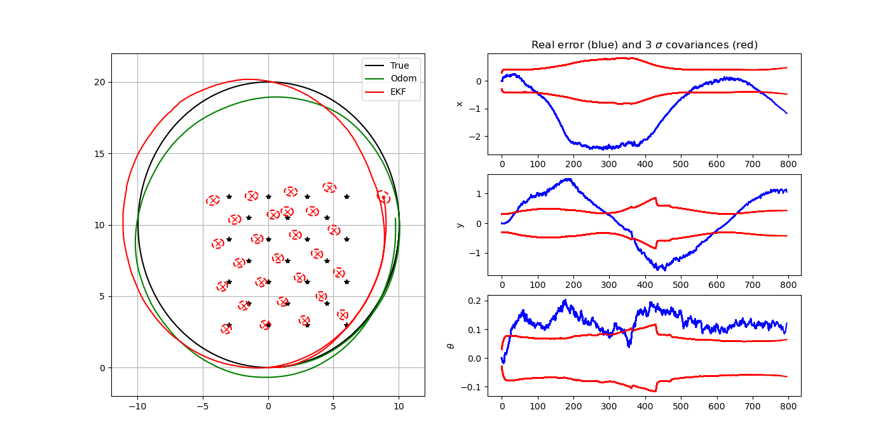

From the simulation results above, it can be observed that reducing the estimated noise parameters (`Q`, `Py`) improves the overall precision of both the pose and the map estimates.

- When `Q` and `Py` are smaller than the simulation values, the filter becomes more confident in its predictions and corrections.  
  As a result, the estimated trajectory closely follows the ground truth, and the landmark positions are more precise.
  The error plots show smaller average errors and tighter fluctuations, indicating smoother tracking and better short-term accuracy.

- When `Q` and `Py` are equal to the simulation values, the results remain stable and realistic.
  The filter shows balanced performance, with consistent covariance bounds that match the real uncertainty.
  The map remains coherent, and the loop closure produces visible correction without instability.

- When `Q` and `Py` are larger than the true values, the filter becomes too conservative.
  The state covariance grows excessively, leading to slower convergence and less accurate landmark estimates.
  The map remains globally consistent but shows larger uncertainty ellipses and slight misalignment between the estimated and true trajectories.
  The landmarks are roughly correct, but the filter updates more cautiously, leading to slower convergence and visible drift in the estimated pose.

---

## Question 4 – Bearing-only EKF-SLAM with Undelayed Initialization

### Goal and general idea

The original EKF-SLAM example used range + bearing measurements and initialized one landmark when a new observation appeared.

For this question we:

1. Change the EKF update to use only bearing (direction to the landmark).
2. Implement undelayed initialization by creating several landmark hypotheses along the observation ray (different fake ranges) with increasing covariance.
3. Maintain for each hypothesis a probability and:
   - at each step, update only the most likely hypothesis;
   - prune hypotheses whose probability becomes smaller than a threshold.
4. Run the simulation with a single real landmark to reproduce the paper’s simple scenario.


### Bearing-only Kalman correction

### Conceptual change

- The measurement vector becomes effectively **1-D**: the filter only uses the bearing component `z = θ`.
- The predicted measurement is the angle from the robot pose to the landmark:
  
  \[
  \hat{z} = \text{atan2}(y_{\text{lm}}-y_r,\; x_{\text{lm}}-x_r) - \theta_r
  \]
- The innovation is `z - z_hat`, wrapped to \([-π, π]\).
- The original Jacobian of the observation model (`jacob_h`) has two rows (range, bearing).  
  We use only the bearing row in the EKF update.
- The measurement noise matrix becomes scalar: just the bearing variance.

### Where this is implemented

- A new function (or modified version) computes the bearing-only innovation and matrices, e.g.  
  `calc_innovation_bearing_only(xEst, PEst, y, LMid)`:
  - uses only `y[1]` (bearing) of the measurement;
  - extracts the second row of the original `H` matrix;
  - uses only the bearing variance from `Py`.
- Both:
  - data association (`search_correspond_landmark_id`), and  
  - the EKF update loop inside `ekf_slam`  
  call this bearing-only innovation instead of the original range+bearing one.

Effect: the correction stage is now driven purely by direction information, which matches the “bearing-only SLAM” setting.


### Undelayed multi-hypothesis initialization

#### Hypothesis structure and parameters

When a new landmark is observed for the first time:

- Instead of waiting for several views (delayed init) or choosing a single arbitrary range, we create N hypotheses along the observation ray.
- Parameters (conceptually):
  - `N_HYP`: number of hypotheses along the ray;
  - `HYP_DISTS`: list of fake ranges (e.g. between 2 m and 10 m);
  - `HYP_COV_BASE`, `HYP_COV_GROW`: control how large the covariance is for near vs. far hypotheses;
  - `PRUNE_THRESH`: probability threshold for pruning.

For each hypothesis `i` we keep a probability `lm_probs[i]`.

#### Creating hypotheses (undelayed init)

When data association decides a measurement corresponds to a new landmark:

1. Take the observed bearing.
2. For each fake distance `r` in `HYP_DISTS`:
   - Build a “virtual” measurement `[r, bearing]`.
   - Convert this to a Cartesian landmark position using the robot pose.
   - Augment the state vector with this position.
   - Augment the covariance matrix using the standard Jacobian-based augmentation (as in the original code).
   - Add an extra covariance term that grows with `r²`, so farther hypotheses are more uncertain.
3. Give each new hypothesis an initial equal probability; normalize the vector `lm_probs`.

Result: as soon as the landmark is seen, the map contains several candidate positions along the ray, with increasing uncertainty, i.e. a simple undelayed bearing-only initialization.

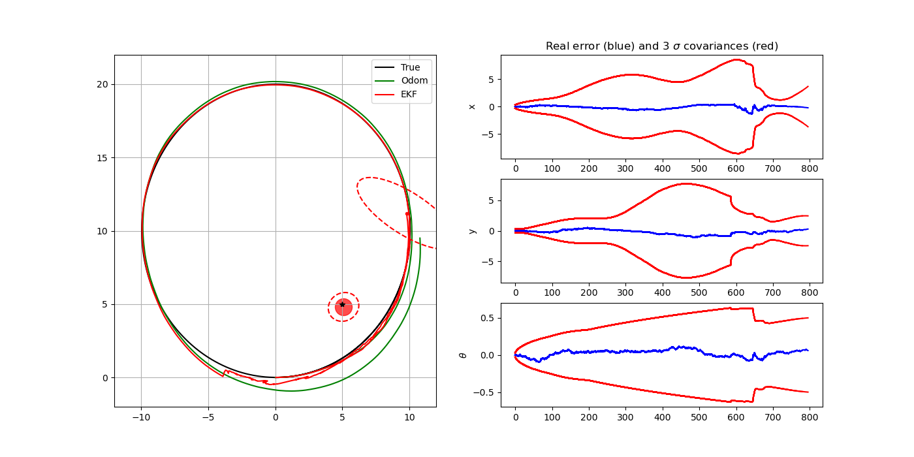

---

### 5 Conclusion

The modified code:

- Implements a bearing-only measurement model in the EKF update.
- Performs undelayed multi-hypothesis initialization of new landmarks along the perception direction, with growing covariances.
- At each time step:
  - updates only the most likely landmark hypothesis, and
  - prunes hypotheses whose probability is below a threshold.
- In an environment with a single landmark, the filter is able to:
  - correctly localize both the robot and the landmark,
  - qualitatively reproduce the behavior expected from Fig. 1 of the reference paper.

---

