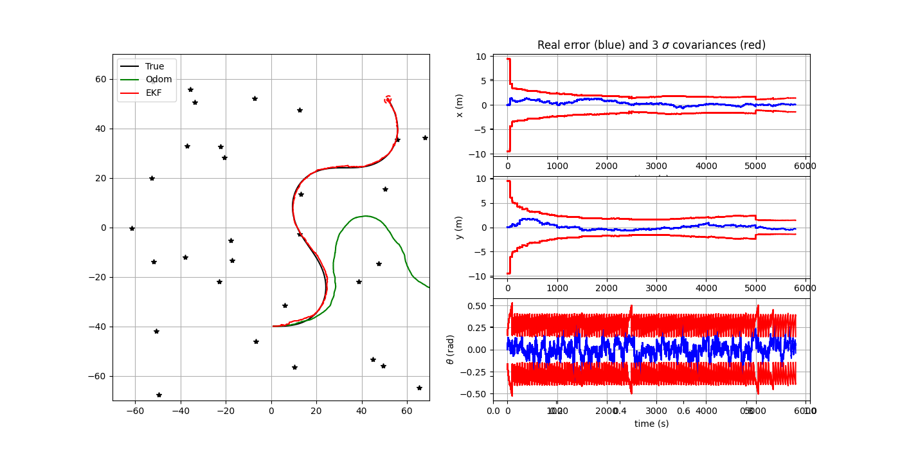
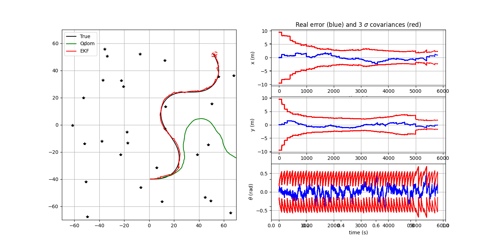
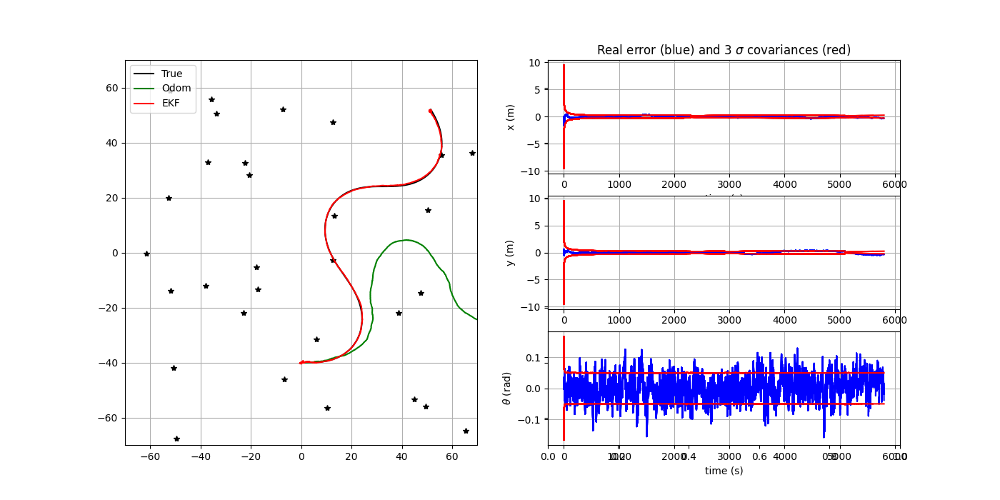
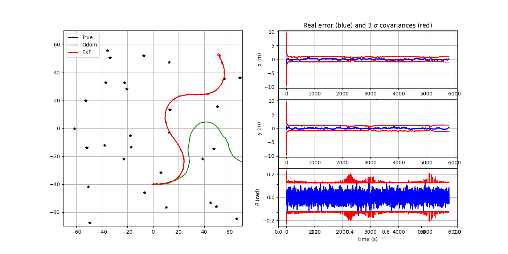
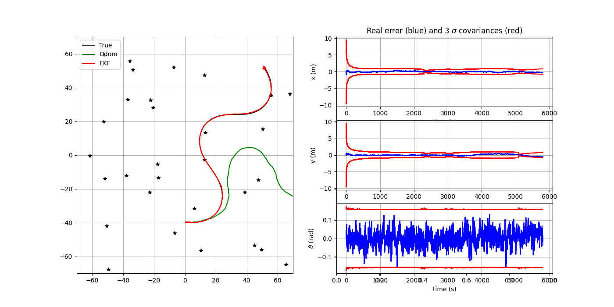
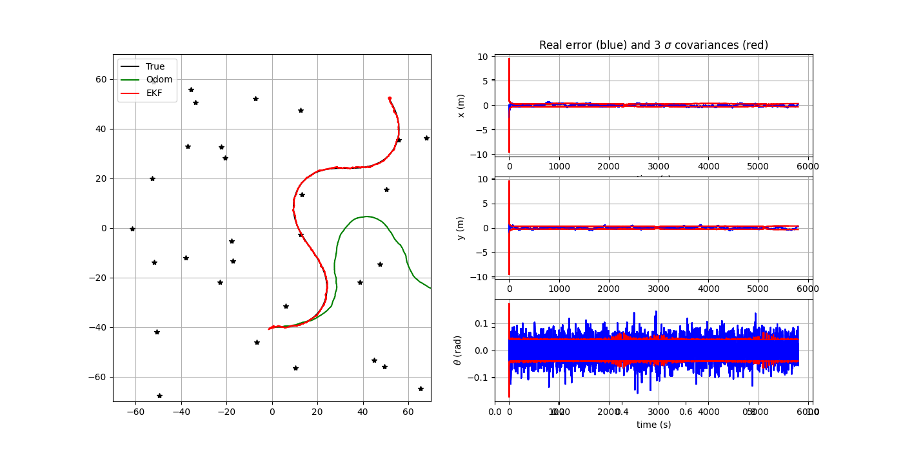
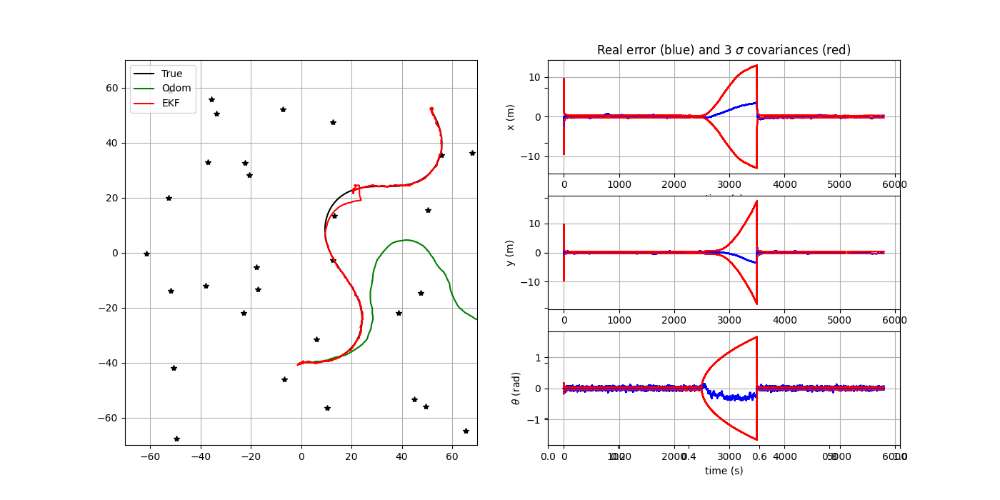
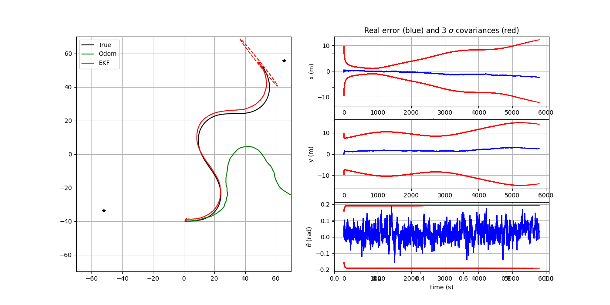
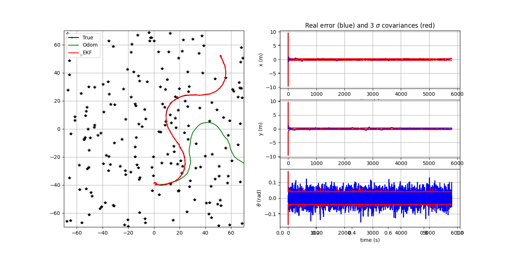
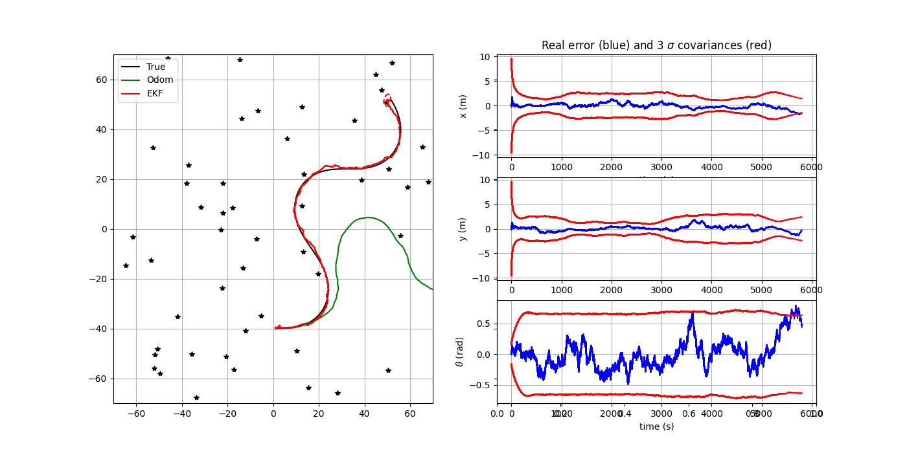

# TD1 – Extended Kalman Filter (EKF) Localization

**Author:** Nívia Araujo da Nóbrega  
**Course:** RO12 – Navigation Robotique 
**Date:** 2025-10-09  

---

## 1. Code Structure

### Code Structure

The implementation is organized into the following main modules:

- **Simulation Module**  
  Handles the robot’s motion and sensing processes.  
  - `simulate_world()` – updates the *true* robot state using the dynamic model.  
  - `get_odometry()` – generates noisy odometry data.  
  - `get_observation()` – provides noisy range/bearing measurements to random landmarks.

- **Dynamic Model**  
  Implements the differential-drive robot kinematics.  
  - `tcomp(x, u, dt)` – computes the new robot pose by integrating the control input over time.

- **Extended Kalman Filter (EKF)**  
  Contains all functions related to state estimation and linearization.  
  - `F(x, u, dt)` and `G(x, u, dt)` – Jacobians of the motion model with respect to the state and process noise.  
  - `observation_model(x, iFeature, Map)` – maps a state to its expected sensor measurement.  
  - `get_obs_jac(x, iFeature, Map)` – computes the Jacobian of the observation model.

- **Main Loop**  
  Executes the EKF algorithm iteratively:
  1. **Prediction step** – estimates the new state and covariance using the motion model.  
  2. **Update step** – refines the estimate when a valid observation is available.

- **Visualization**  
  The simulation display shows:
  - **True trajectory** (black)  
  - **Odometry-only trajectory** (green)  
  - **EKF estimate** (red)  
  as well as the estimation errors and ±3σ confidence intervals.

---

## 2. Code Completion and Initial Results

The EKF equations were implemented as follows:

### **Prediction:**

\[
\hat{\mathbf{x}}_k^- = f(\hat{\mathbf{x}}_{k-1}, \tilde{\mathbf{u}}_k)
\]

\[
P_k^- = F_k P_{k-1} F_k^T + G_k Q_k G_k^T
\]

### **Update:**

\[
K_k = P_k^- H_k^T (H_k P_k^- H_k^T + R_k)^{-1}
\]

\[
\hat{\mathbf{x}}_k = \hat{\mathbf{x}}_k^- + K_k \left( \mathbf{z}_k - h(\hat{\mathbf{x}}_k^-) \right)
\]

\[
P_k = (I - K_k H_k) P_k^-
\]

The results show that the EKF trajectory (red) quickly converges toward the true trajectory (black),  
while the odometry-only trajectory (green) gradually drifts due to accumulated noise.

---

## 3. Effect of the Measurement Frequency (`dt_meas`)

When `dt_meas` increases (less frequent measurements):
- Corrections occur less often, so the robot follows odometry more closely (greater drift).
- The uncertainty (standard deviation) grows between updates.

When `dt_meas` decreases (more frequent measurements):
- The estimation error decreases.
- The filter remains more stable and consistent.

*Figure 1 – Robot trajectory with measurement period dt_meas = 50 s.*

*Figure 2 – Robot trajectory with measurement period dt_meas = 100 s.*

---

## 4. Influence of the Process Noise (`QEst`)

When `QEst` increases:
- The filter trusts the motion model less.
- The prediction uncertainty increases.
- The filter relies more on sensor corrections.

*Figure 3 – Robot trajectory with Process noise *0.1 .*

When `QEst` decreases:
- The filter trusts the motion model too much.
- It reacts less to sensor data, and convergence becomes slower.

*Figure 3 – Robot trajectory with Process noise *10 .*

---

## 5. Influence of the Measurement Noise (`REst`)

When `REst` increases:
- The filter trusts the sensors less.
- Corrections are weaker, and errors increase.

*Figure 3 – Robot trajectory with Measurement noise *10 .*

When `REst` decreases:
- The filter overreacts to noisy measurements.
- This can cause oscillations or even local divergence.

*Figure 3 – Robot trajectory with Measurement noise *0.1 .*

---

## 6. Simulation of a Measurement Gap (t = 2500 to 3500 s)

During the absence of measurements:
- The filter operates only in prediction mode.
- The uncertainty matrix \( P \) increases significantly.
- As soon as measurements resume, the filter quickly “catches up” with the true trajectory.

Graphically, the red curve diverges temporarily and then rejoins the black one after t = 3500 s.

*Figure 3 – Robot trajectory with Measurement Gap (t = 2500 to 3500 s).*

---

## 7. Influence of the Number of Landmarks

With **few landmarks**:
- Observations are rare → the estimation becomes unstable, especially in orientation.

*Figure 3 – Robot trajectory with 2 landmarks.*

With **many landmarks**:
- Frequent and accurate corrections → improved performance.
- The optimal balance depends on the noise ratio and the observation frequency.

*Figure 3 – Robot trajectory with 200 landmarks.*

In the following experiment, the chosen parameters provide an excellent balance between confidence in the motion model and reliance on sensor measurements, resulting in a smooth and accurate Extended Kalman Filter (EKF) performance. By setting a relatively small process noise (QTrue) and assuming a slightly smaller modeled noise (QEst = 0.5 * QTrue), the filter trusts its dynamics enough to produce stable predictions without becoming overconfident. The larger estimated measurement noise (REst = 10 * RTrue) prevents overreaction to sensor noise, keeping the estimation robust and preventing oscillations. The high landmark density (nLandmarks = 50) and frequent updates (dt_meas = 1 s) ensure continuous correction and strong state observability. As a result, the EKF trajectory (red) aligns almost perfectly with the true trajectory (black), while odometry (green) drifts due to accumulated errors. The error plots confirm that the real errors (blue) remain within the ±3σ bounds (red), demonstrating a well-calibrated and consistent filter.

*Figure 3 – Robot trajectory with the following parameters:*

| Parameter            | Description                                            | Value / Effect                                                   |
| -------------------- | ------------------------------------------------------ | ---------------------------------------------------------------- |
| `QTrue`              | True process noise covariance (motion uncertainty)     | `diag([0.01, 0.01, 1°])²` – small motion noise                   |
| `QEst`               | Estimated process noise used by the filter             | `0.5 * QTrue` – slightly more confidence in motion model         |
| `RTrue`              | True measurement noise covariance (sensor uncertainty) | `diag([3.0 m, 3°])²` – realistic sensor noise                    |
| `REst`               | Estimated measurement noise used by the filter         | `10 * RTrue` – less trust in measurements, avoids overcorrection |
| `nLandmarks`         | Number of landmarks in the environment                 | `50` – high observation density improves estimation              |
| `dt_pred`, `dt_meas` | Prediction and measurement intervals                   | `1 s` – frequent updates, stable convergence                     |

---

## 8. “Range Only” Case (Distance Measurements Only)

When only distance measurements are available:
- Directional information is missing → positional ambiguity increases.
- The uncertainty in orientation (θ) grows.
- Convergence becomes slower and less accurate.

To compensate, `QEst` should be reduced and `REst` slightly increased.

*Figure 3 – Robot trajectory with QEst*0.7 and REst*5 for range only:*

---

## 9. “Angle Only” Case (Bearing Measurements Only)

When only bearing measurements are available:
- The robot’s orientation is well constrained, but the radial position is not.
- Distance errors increase are very slight and the angle estimation is more accurate for different parameter configurations.

*Figure 3 – Robot trajectory with QEst*0.7 and REst*5 for range only:*

---

## 10. Conclusion

- The EKF effectively corrects odometry drift using noisy sensor measurements.  
- Performance depends on the ratio between the process and measurement covariances (`QEst` and `REst`).  
- Proper tuning of these covariances and the number of landmarks achieves an optimal trade-off between accuracy and stability.

---

