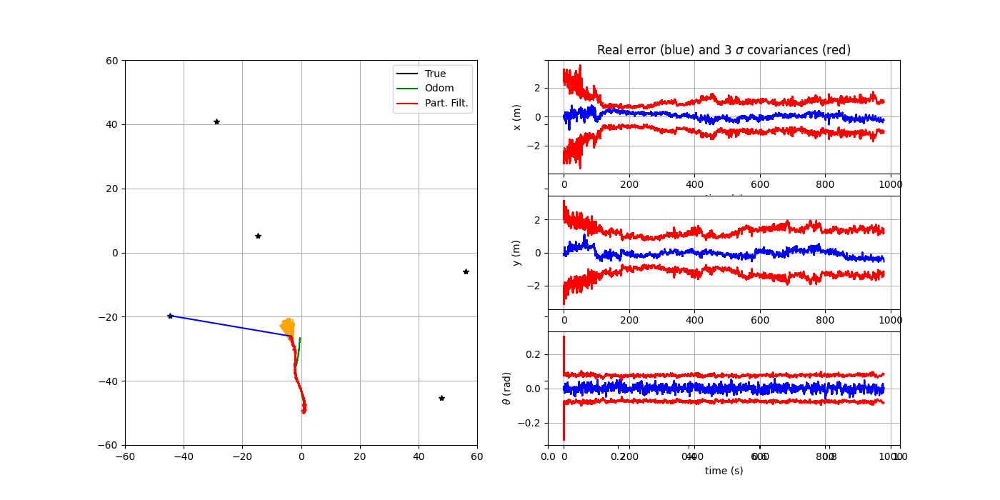
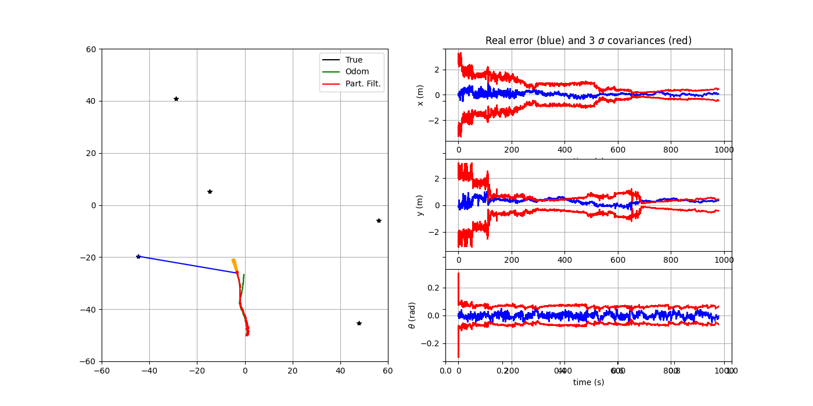
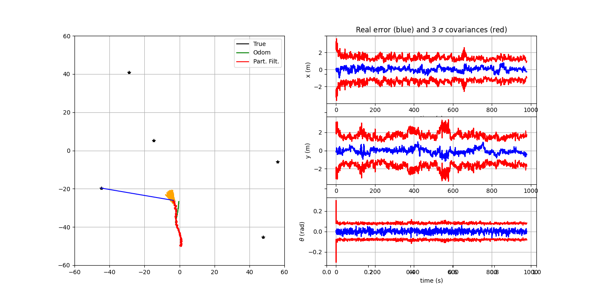
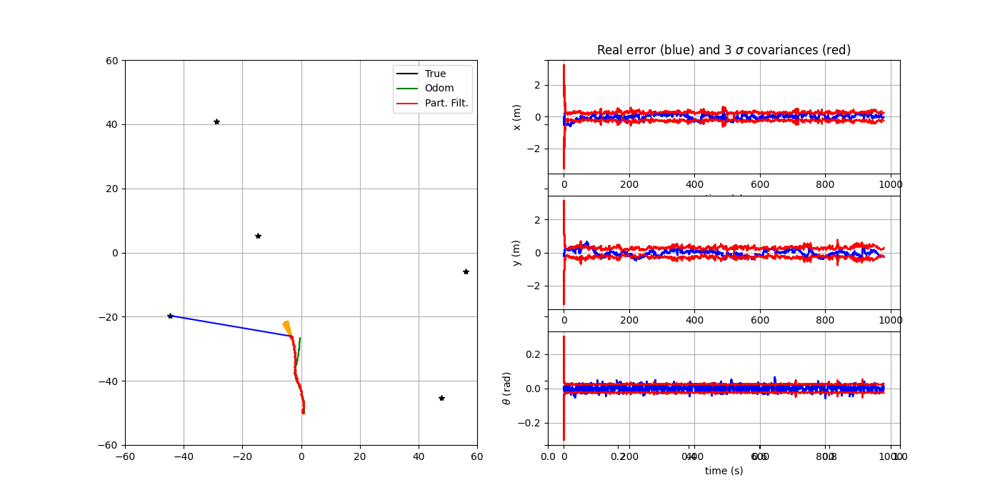
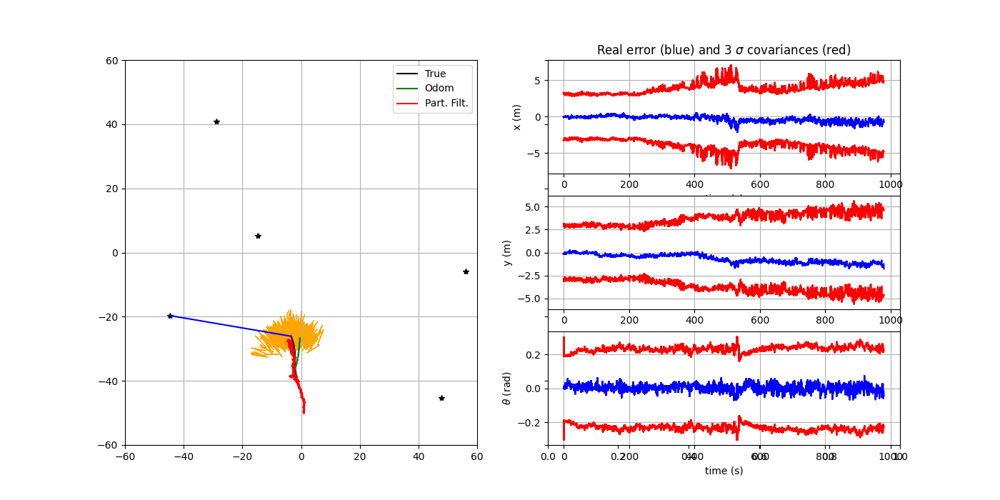
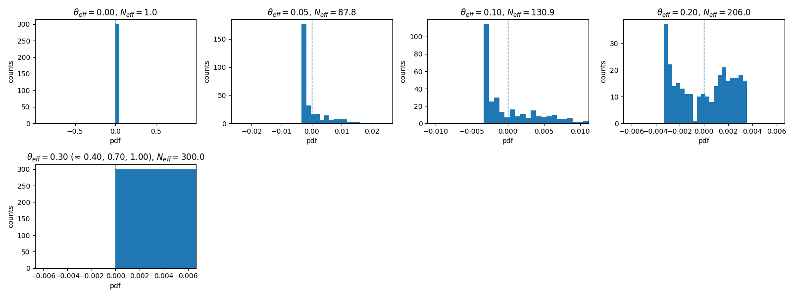
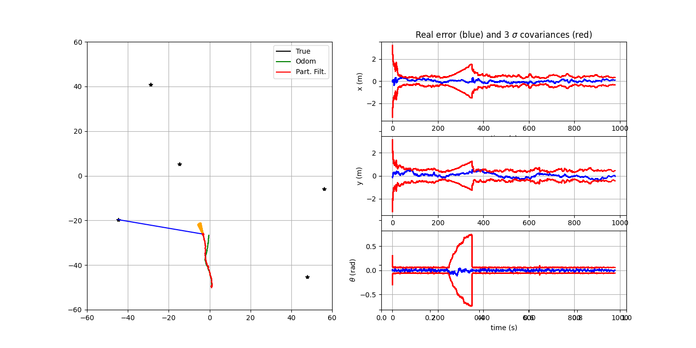
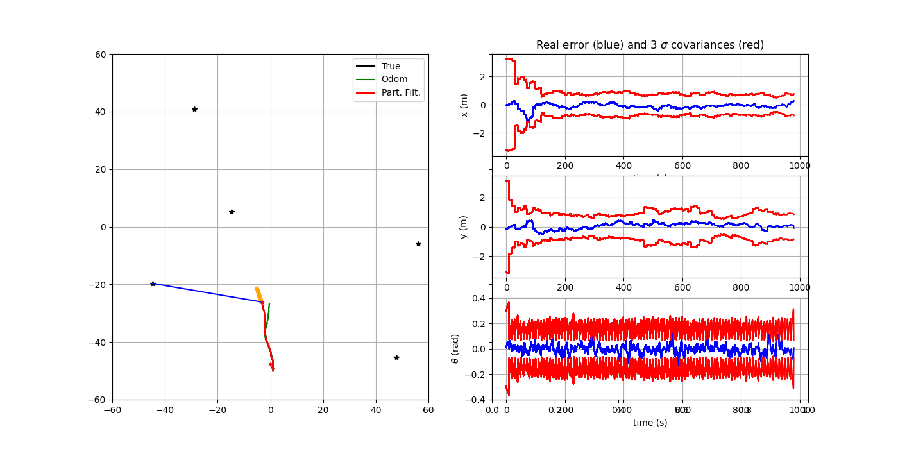
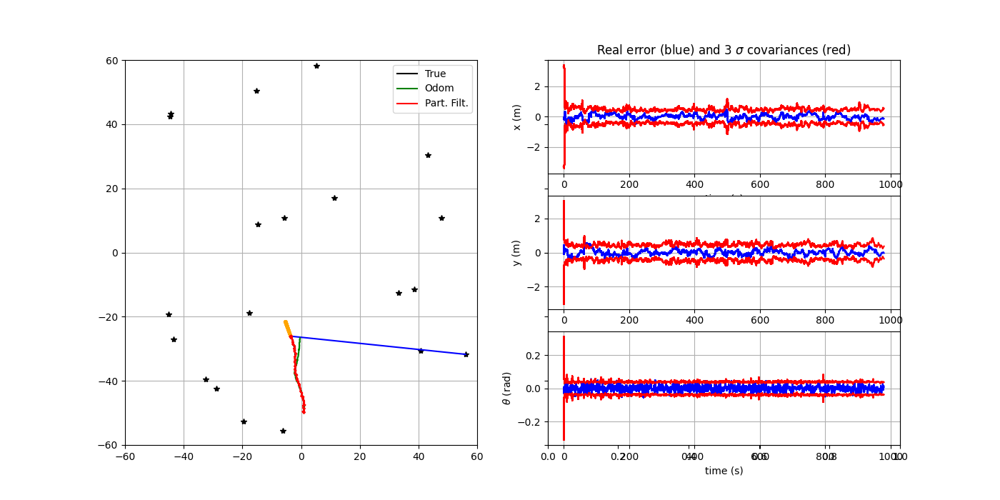
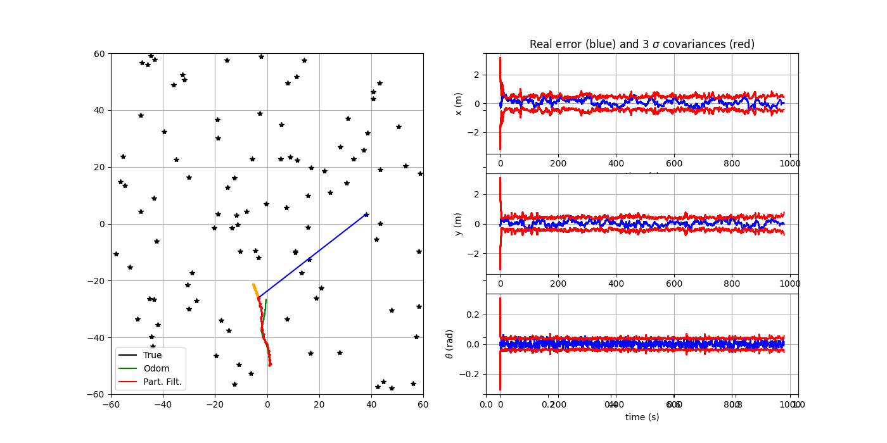

# TD2 – Filtrage Particulaire appliqué à la navigation et à l’estimation d’état

**Author:** Nívia Araujo da Nóbrega  
**Course:** RO12 – Navigation pour les systèmes autonomes  
**Date:** 2025-10-17  

---

## 1. Getting Started with the Code and Filter Parameters

### 1.1. General Organization

Briefly describe **the major parts** of the code and their roles:

* `Simulation`: world, trajectory, odometry, sensor, landmark map  
* **Models**: `motion_model` (f), `observation_model` (h)  
* **PF**: prediction, update (correction), weighting, resampling  
* **Plots**: visualization functions, histories, metrics

### 1.2. Important Parameters

List and comment parameters (initial values + meaning):

| Parameter | Meaning | Unit | Example |
|---|---|---|---|
| `nParticles` | Number of particles | — | 500 |
| `QTrue`, `RTrue` | True (simulation) noise covariances | m², rad² | diag([0.01², 0.01², (1°)²]) |
| `QEst`, `REst` | Modeled (filter) noise covariances | m², rad² | Tuned |
| `dt_pred`, `dt_meas` | Prediction step / measurement rate | s | 0.1 / 1.0 |
| `theta_eff` | Resampling threshold (fraction of effective sample size) | — | 0.5 |
| `nLandmarks`, `Map` | Number and positions of landmarks | — / m | 5 / array |
| State | \(x = [x, y, \theta]^T\) | — | — |
| Control | \(u = [v_x, v_y, \dot{\theta}]^T\) | m/s, rad/s | — |

---

## 2. Complete the PF Code (Models + Equations)

### 2.1. Dynamic Model — `motion_model`

* Continuous/discrete form, SE(2) composition, Euler integration  
* Add process noise \(Q_{Est}\)  

### 2.2. Measurement model — `observation_model`

* Measurement $(z = \rho, \alpha^T)$: range and bearing of a landmark *i*  
* Relative geometry + heading subtraction $(\theta)$  

---

### 2.3. PF steps (slide 25)

* **Prediction**: propagate each particle via `motion_model`  
* **Correction**: weight update using Gaussian likelihood with (R_{Est})  
* **Normalization** of weights  
* **Estimation**: weighted mean, empirical covariance, standard deviation  
* **Resampling**: low-variance (provided) + condition (N_{eff})

```python
# Main loop (extracts)
# 1) xParticles[:, p] = motion_model(...)
# 2) zPred = observation_model(...)
#    Innov = z - zPred ; Innov[1] = angle_wrap(...)
#    w[p] ∝ exp(-0.5 * Innov^T R^{-1} Innov)
# 3) w /= sum(w)
# 4) xEst = average(xParticles, weights=w)
#    PEst = weighted covariance ; xSTD = sqrt(diag(PEst))
# 5) N_eff = 1 / sum(w**2); if N_eff < nParticles*theta_eff -> re_sampling
```

---

### 2.4. Quick validation

* `Check consistency`:
The estimated heading and position signs are coherent with the motion model. The particle orientations align reasonably with the robot’s direction of travel.

* `Weight behavior`:
When a landmark observation (z) is received, the particle cloud (orange arrows) contracts around the true position, indicating that the filter correctly reweights toward higher-probability hypotheses.

* `Visual inspection`:
  The trajectories and uncertainty plots show stable estimation performance.

  Error plots (blue/red): actual estimation errors (blue) remain within the ±3σ confidence bounds (red), showing a consistent and well-calibrated uncertainty estimate. 


*Figure 1 – Robot trajectory with PF *

---

## 3. Parametric study — process noise (QEst)
 
**Hypothesis:**  
Increasing $Q_{Est}$ produces a more diffuse particle set. This should improve robustness to model mismatch and outliers, but typically increases the estimator variance.

---

**Qualitative results:**  
The figures below illustrate particle-filter behavior for two representative cases:

  
*Figure 2 – $Q_{Est} = 0.5\, Q_{True}$: particles remain tight; faster convergence but more prone to bias if motion noise is underestimated.*

  
*Figure 3 – $Q_{Est} = 2\, Q_{True}$: particles spread wider; better state-space coverage and robustness, at the cost of larger uncertainty (wider $\pm 3\sigma$ bands and noisier instantaneous errors).*

When noise is **underestimated** ($Q_{Est} = 0.5\, Q_{True}$), particles cluster too aggressively; the filter may track quickly but can lock into a biased hypothesis.  
With **larger** noise ($Q_{Est} = 2\, Q_{True}$), the particle cloud explores more and can correct model deviations, but uncertainty grows accordingly.

---

## 4. Parametric study — measurement noise $R_{Est}$

**Hypothesis.** Smaller $R_{Est}$ (overconfident sensors) makes the likelihood sharper, yielding more *selective* weights and more frequent resampling; this can decrease steady-state error when the model matches, but risks bias/instability under outliers or model mismatch. Larger $R_{Est}$ (underconfident sensors) spreads likelihoods, producing less selective weights, larger $N_{eff}$, fewer resamplings, and estimates that rely more on motion prediction (typically higher variance but smoother behavior).

---

**Qualitative observations from the runs:**

  
*Figure 4a – $R_{Est} = 0.5\,R_{True}$* 

Tight innovation gating (blue errors pulled strongly toward measurements). Particles reweight aggressively; $N_{eff}$ drops quickly after updates leading to frequent resampling. The $\pm3\sigma$ envelopes (red) are tighter and track the instantaneous error closely; sensitive to spurious or misassociated measurements.

  
*Figure 4b – $R_{Est} = 2\,R_{True}$* 

Softer updates; particles remain more diffuse and $N_{eff}$ stays higher, reducing resampling frequency. The estimate leans more on the motion model; error bands widen slightly and errors fluctuate less violently, but steady-state error can increase.

---


# 5. Resampling threshold (\(\theta_{\text{eff}}\)) and degeneracy — histogram results

**Protocol.** We sweep \(\theta_{\text{eff}}\in[0,1]\) (e.g., 0.0, 0.1, 0.2, 0.3, 0.4, 0.7, 1.0). For each value we run the particle filter, then plot **histograms of centered weights** \(w_i-1/N\) and record the final **effective sample size** \(N_{\text{eff}}=1/\sum_i w_i^2\). Panels with indistinguishable outcomes (e.g., flat, uniform weights after a last resample) are collapsed to a single representative plot.

  
*Figure 5 – Histrogram plots*

## What the histograms show
- **Low thresholds (e.g., \(\theta_{\text{eff}}=0.0\)–0.1): degeneracy.** The distribution is highly skewed: many particles have \(w_i-1/N<0\) (lighter than uniform) and a small tail \(>0\) (few heavy particles). \(N_{\text{eff}}\) is low (down to \(\approx 1\) at \(\theta_{\text{eff}}=0\)).
- **Intermediate threshold (\(\approx 0.2\)): recovering diversity.** Weights spread around \(0\); \(N_{\text{eff}}\) rises substantially (e.g., \(\approx 200\) for \(N=300\)).
- **Higher thresholds (\(\ge 0.3\)): frequent resampling \(\rightarrow\) uniform weights.** The final histogram collapses to a single bar at \(0\) (since \(w_i\approx 1/N\)); \(N_{\text{eff}}\approx N\). Multiple \(\theta_{\text{eff}}\) values produce the **same** end state, so we display only one representative panel and list the merged \(\theta\) values.

## Interpretation
- **Degeneracy:** small \(\theta_{\text{eff}}\) delays resampling; weights collapse and \(N_{\text{eff}}\) falls.
- **Impact of resampling:** increasing \(\theta_{\text{eff}}\) prevents collapse (higher \(N_{\text{eff}}\)) but, if too aggressive, can lead to **sample impoverishment** (diversity loss across time) even though the final histogram looks perfectly uniform.
- **Practical choice:** resample when \(N_{\text{eff}} < \alpha N\) with \(\alpha\in[0.3,0.7]\). In our runs, \(\alpha\approx0.3\)–0.5 strikes a good balance between avoiding degeneracy and limiting unnecessary resampling.

---

# 6. Measurement Outage (t = 250–350 s)


## How to activate
Set the simulator’s flag during the chosen window:
```python
# inside the main loop
if 250 <= k * dt_pred <= 350:
    simulation.notValidCondition = True   # suppress measurements
else:
    simulation.notValidCondition = False  # normal operation
```

## Observed Results
- **Uncertainty diffusion:** covariance (red ±3σ) grows while only the motion model runs.
- **Odometry-driven drift:** the state estimate follows dead-reckoning and accumulates bias.
- **Recovery:** once measurements resume, errors decrease and covariance tightens.

  
*Figure 6 – Trajectory with Measurement outage*

---

# 7. Measurement Frequency (dt_meas = 0.1 Hz)

## How to set it
With `dt_pred = 1 s`, set:
```python
dt_meas = 10  # one measurement every 10 s  -> 0.1 Hz
```
This means the correction step runs only when `k * dt_pred % dt_meas == 0`.

## Observed results 
- Position errors grow more between updates, and the covariance shows a clear saw‑tooth pattern synchronized with the 10 s updates.
- Orientation uncertainty fluctuates with higher amplitude compared to the 1 Hz case.
- After each measurement, the estimate recenters and the covariance briefly collapses, but overall drift remains higher than at 1 Hz.

  
*Figure 6 – Trajectory with higher measurement frequency*

---

# 8. Number of landmarks (nLandmarks)

### nLandmarks = 20


**Observations.**
- Landmarks are moderately sparse; measurement geometry varies as the robot moves.
- The red bands (±3σ) in x/y stay roughly within ~±1 m and track the true error (blue) without visible inconsistency.
- Heading uncertainty remains small and stable thanks to regular bearing updates.
- Effective sample size (qualitatively) decreases between updates and is restored by resampling; frequency is moderate.

### nLandmarks = 100


**Observations.**
- Dense landmark field produces frequent, well-conditioned range–bearing geometry.
- Position bands tighten slightly compared to the 20-landmark case; transients are shorter after motion changes.
- The filter becomes more **informative per update**, so particle weights concentrate faster → more frequent resampling (lower N_eff after each update), but accuracy improves.

---

# 9. Alternative resampling method

**Chosen method:** **Residual + Stratified resampling** (Li, Bolic, Djuric, *IEEE SPM*, 2015).  
It splits resampling into a **deterministic** part (each particle gets `⌊N·wᵢ⌋` copies) and a **random** part that draws the **residual** `R = N - Σ⌊N·wᵢ⌋` particles with **stratified** sampling (lower variance than multinomial).

---

## Algorithm

For normalized weights `w` and `N` particles:

1. Compute integer copies `Nᶜᵢ = ⌊N·wᵢ⌋`. Collect their indices (deterministic).  
2. Compute residual weights `wʳ = N·w - Nᶜ`. Normalize `wʳ` over the `R = N - ΣNᶜ` residual draws.  
3. Draw `R` indices with **stratified** sampling from `wʳ`.  
4. Concatenate deterministic and residual indices, optionally shuffle, and reset weights to `1/N`.

**Complexity:** `O(N)` time and `O(N)` memory.  
**Property:** Lower variance of offspring counts than multinomial/systematic when weights are uneven; helps slow particle impoverishment while retaining efficiency.

---

## Comparison with provided low‑variance (systematic) method

| Criterion | Low‑variance (Systematic) | Residual + Stratified (proposed) |
|---|---|---|
| Time complexity | `O(N)` | `O(N)` |
| Variance of offspring counts | Low (vs multinomial) | **Lower or comparable**, especially for peaky weights |
| Diversity after resampling | Good | **Often better** when weights are highly uneven |
| Implementation | Simple | Slightly more code |
| When it shines | Moderate weight disparity | **High disparity** (informative measurements, many landmarks) |

Intuition: when a few particles dominate (`wᵢ ≫ 1/N`), residual gives them their deserved quota **deterministically**, and uses randomness only for the remainder. This reduces the randomness in the number of children for strong particles, hence **lower resampling noise**.

---

## Results & interpretation


- With a **dense landmark field** (e.g., `nLandmarks = 100`), the likelihood is sharp ⇒ weights concentrate each update.  
- **Residual + Stratified** maintains **slightly tighter** ±3σ envelopes and small mean errors, with **stable** behavior across time.  
- Qualitatively, the **effective sample size (N_eff)** drops more slowly after each update compared to standard systematic, and the set of **unique indices** after resampling is higher (less impoverishment).

> Bottom line: For highly informative measurements, **Residual + Stratified** improves diversity with unchanged `O(N)` cost, yielding equal or better accuracy and smoother covariance traces.

---

##  References

* [12] (slide 36), provided pdf  
* Classical PF references (Doucet et al.)

